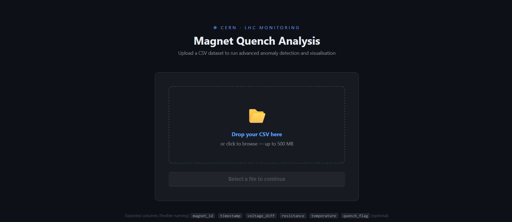
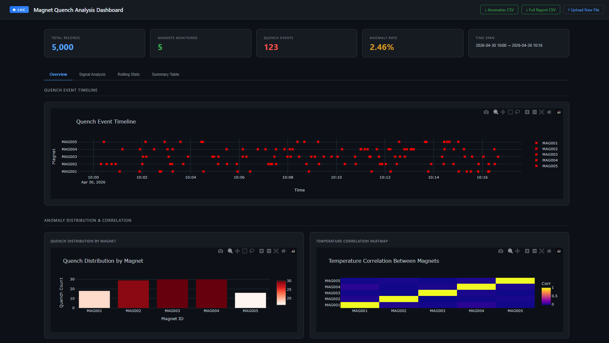
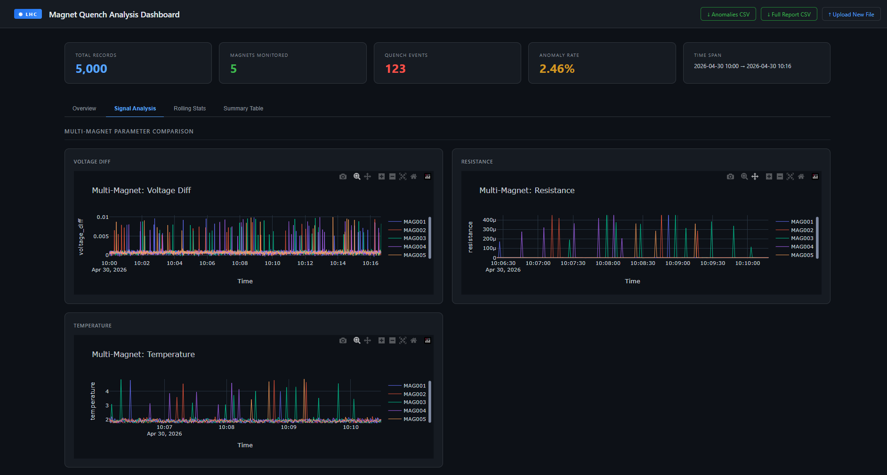
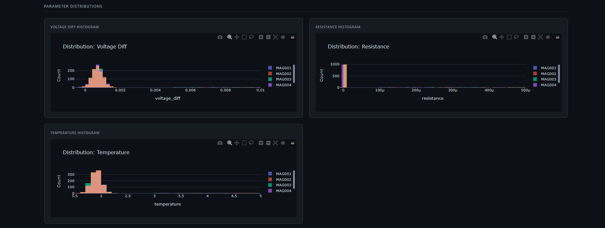
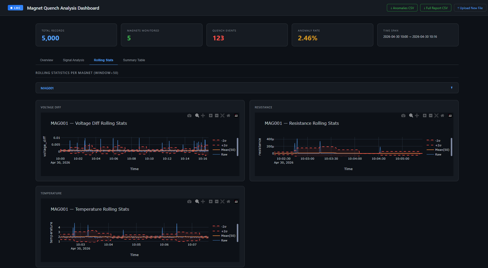
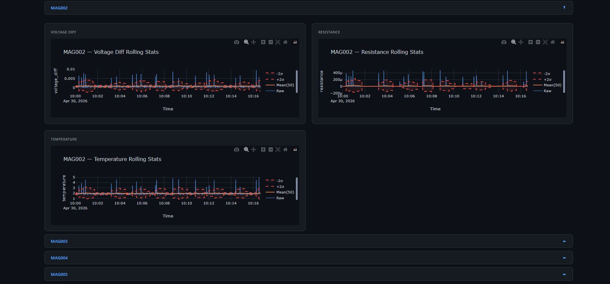
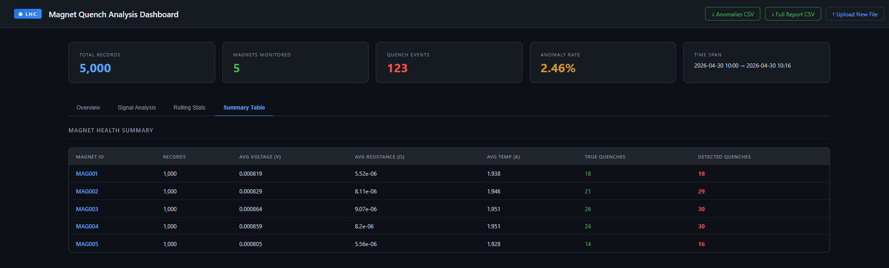

<div align="center">

# ⚛️ SigMon
### Real-Time Signal Monitoring & Anomaly Detection Platform for Large Hadron Collider(LHC)

[](https://python.org)
[](https://flask.palletsprojects.com)
[](https://plotly.com)
[](https://docker.com)
[](https://gitlab.com)
[](LICENSE)

*An advanced web-based platform for uploading, analysing, and visualising large-scale LHC superconducting magnet datasets — with automated quench detection, interactive dashboards, and one-click report export.*

</div>

---

## 📋 Table of Contents

- [Overview](#-overview)
- [Screenshots](#-screenshots)
- [Features](#-features)
- [Detection Algorithm](#-detection-algorithm)
- [Project Structure](#-project-structure)
- [Quick Start](#-quick-start)
- [CSV Format](#-csv-format)
- [API Reference](#-api-reference)
- [Docker Deployment](#-docker-deployment)
- [CI/CD Pipeline](#-cicd-pipeline)
- [Tech Stack](#-tech-stack)

---

## 🔭 Overview

SigMon is built for physicists and engineers working with Large Hadron Collider(LHC) superconducting magnet data. It accepts any large CSV dataset (up to **500 MB**), automatically maps column names using flexible aliases, runs a dual-method quench detection algorithm (threshold + z-score), and renders a fully interactive dark-themed dashboard — all without writing a single line of code.

The platform is designed around three principles:

- **Flexibility** — column names are auto-detected via aliases, so any LHC-style CSV works out of the box
- **Performance** — large files are loaded in 50,000-row chunks and results are cached as Parquet for instant report downloads
- **Observability** — every detected quench event is traceable across timeline, distribution, correlation, rolling statistics, and histogram views

---

## 📸 Screenshots

### Upload Interface


### Dashboard Overview


### Signal Analysis — Multi-Magnet Parameter Comparison


### Signal Analysis — Parameter Distributions


### Rolling Statistics with Confidence Bands


### Rolling Statistics with Confidence Bands


### Magnet Health Summary Table & Report Export


---

## ✨ Features

### 📂 Smart CSV Upload
- Drag-and-drop or browse — up to **500 MB**
- Real-time upload progress bar
- Automatic column detection with visual mapping feedback
- Graceful handling of missing or non-standard column names

### 🔍 Dual-Method Quench Detection
- **Threshold detection** — hard limits on voltage, resistance, and temperature
- **Z-score detection** — statistical outlier detection per magnet (σ > 3)
- Optional **persistence filter** — requires N consecutive anomalies before flagging
- Fits on normal (non-quench) data only, preventing contamination

### 📊 Interactive Dashboard (4 tabs)

| Tab | Contents |
|-----|----------|
| **Overview** | Quench event timeline · Anomaly distribution bar chart · Temperature correlation heatmap |
| **Signal Analysis** | Multi-magnet parameter comparison · Per-parameter histograms |
| **Rolling Stats** | Per-magnet rolling mean ± 2σ bands for voltage, resistance, temperature |
| **Summary Table** | Per-magnet health stats with avg voltage, resistance, temperature, quench counts |

### 📈 KPI Cards
- Total records processed
- Number of magnets monitored
- Total quench events detected
- Anomaly rate (%)
- Full time span of the dataset

### 📥 Report Export
- **Anomalies CSV** — only detected quench rows
- **Full Report CSV** — all rows with `detected_quench_flag` column appended
- Instant download — results cached as Parquet after first analysis

### 🚀 Production Ready
- Dockerised with multi-stage build
- GitLab CI/CD pipeline (test → build → deploy)
- Non-root container user
- Persistent volume for uploads across restarts

---

## 🧠 Detection Algorithm

Each row is evaluated independently per magnet using two complementary methods:

```
┌─────────────────────────────────────────────────────────┐
│                   MagnetQuenchDetector                  │
│                                                         │
│  fit(normal_df)  →  compute per-magnet μ, σ             │
│                                                         │
│  detect_single(row):                                    │
│    threshold_flag  =  V > 0.005  OR                     │
│                       R > 1e-4   OR                     │
│                       T > 3.0 K                         │
│                                                         │
│    z_flag  =  (x - μ) / σ  >  3  for V, R, or T        │
│                                                         │
│    raw_anomaly  =  threshold_flag  OR  z_flag           │
│                                                         │
│    [optional]  persistence_filter(raw_anomaly, window)  │
│                                                         │
│    → detected_quench_flag  ∈  {0, 1}                    │
└─────────────────────────────────────────────────────────┘
```

The detector is **fitted only on rows where `quench_flag == 0`** (normal operation), ensuring quench events do not skew the baseline statistics.

---

## 📁 Project Structure

```
SigMon/
├── app/
│   ├── advanced_analysis_app.py   # Flask application — routes, plots, detection
│   ├── __init__.py
│   └── templates/
│       ├── upload.html            # CSV upload page
│       └── advanced_analysis.html # Interactive dashboard
│
├── src/
│   ├── __init__.py
│   └── detection/
│       ├── __init__.py
│       └── magnet_detector.py     # MagnetQuenchDetector, PersistenceDetector
│
├── data/
│   └── magnet_dataset.csv         # Sample LHC magnet dataset
│
├── tests/
│   └── test_smoke.py              # Smoke tests for CI pipeline
│
├── Dockerfile                     # Multi-stage Docker build
├── docker-compose.yml             # Compose for local dev & server deploy
├── .gitlab-ci.yml                 # GitLab CI/CD — test → build → deploy
├── .gitignore
└── requirements.txt
```

---

## ⚡ Quick Start

### Prerequisites
- Python 3.10+
- pip

### 1. Clone & install

```bash
git clone https://gitlab.com/YOUR_USERNAME/sigmon.git
cd sigmon

python -m venv .venv
# Windows
.venv\Scripts\activate
# Linux / macOS
source .venv/bin/activate

pip install -r requirements.txt
```

### 2. Run

```bash
python app/advanced_analysis_app.py
```

Open [http://localhost:5002](http://localhost:5002) in your browser.

### 3. Upload & analyse

1. Drag your CSV onto the upload page
2. Review the auto-detected column mapping
3. Click **Run Analysis**
4. Explore the dashboard tabs
5. Download reports from the header buttons

---

## 📄 CSV Format

SigMon auto-maps column names using aliases — exact names are not required.

### Expected columns

| Canonical name | Accepted aliases | Required |
|---|---|---|
| `magnet_id` | `magnet`, `id`, `device`, `element`, `name` | Yes |
| `timestamp` | `time`, `datetime`, `date`, `t` | Yes |
| `voltage_diff` | `voltage`, `v`, `volt`, `dv`, `delta_v` | Yes |
| `resistance` | `r`, `res`, `ohm` | Yes |
| `temperature` | `temp`, `t_kelvin`, `kelvin`, `t_k` | Yes |
| `quench_flag` | `quench`, `flag`, `label`, `anomaly`, `fault` | No (defaults to 0) |

### Example rows

```csv
timestamp,magnet_id,voltage_diff,resistance,temperature,quench_flag
2026-04-30 10:00:00,MAG001,0.000715,0.000001,1.90,0
2026-04-30 10:01:05,MAG001,0.007956,0.000163,4.14,1
2026-04-30 10:00:00,MAG002,0.000823,0.000001,1.88,0
```

> Files up to **500 MB** are supported. Larger files are loaded in 50,000-row chunks.

---

## 🔌 API Reference

| Method | Endpoint | Description |
|--------|----------|-------------|
| `GET` | `/` | Upload page |
| `POST` | `/upload` | Upload CSV, returns `file_id` and column mapping |
| `GET` | `/analyze/<file_id>` | Run analysis and render dashboard |
| `GET` | `/report/csv/<file_id>` | Download anomaly rows as CSV |
| `GET` | `/report/full/<file_id>` | Download full dataset + detection flag as CSV |
| `GET` | `/api/data/<file_id>?page=1&per_page=100` | Paginated JSON data |

### Upload response example

```json
{
  "file_id": "a3f2c1d4-...",
  "columns": ["timestamp", "magnet_id", "voltage_diff", "resistance", "temperature"],
  "col_map": {
    "timestamp": "timestamp",
    "magnet_id": "magnet_id",
    "voltage_diff": "voltage_diff",
    "resistance": "resistance",
    "temperature": "temperature"
  },
  "missing_canonical": []
}
```

---

## 🐳 Docker Deployment

### Build and run locally

```bash
docker compose up --build
```

App available at [http://localhost:5002](http://localhost:5002).

### Run a pre-built image

```bash
docker run -p 5002:5002 \
  -v lhc_uploads:/tmp/lhc_uploads \
  registry.gitlab.com/YOUR_USERNAME/sigmon:latest
```

---

## 🔄 CI/CD Pipeline

The GitLab pipeline runs automatically on every push.

```
push to branch
      │
      ▼
  ┌────────┐     MR or main/develop
  │  TEST  │ ──────────────────────── pytest smoke tests
  └────────┘
      │ main or develop
      ▼
  ┌────────┐
  │ BUILD  │ ── docker build → push to GitLab Container Registry
  └────────┘        image:SHA  +  image:latest (main only)
      │ main only
      ▼
  ┌────────┐
  │ DEPLOY │ ── SSH → docker compose up -d on production server
  └────────┘
```

### Required CI/CD Variables

Set these in **GitLab → Settings → CI/CD → Variables**:

| Variable | Description | Type |
|---|---|---|
| `DEPLOY_HOST` | Server IP or hostname | Variable |
| `DEPLOY_USER` | SSH username on server | Variable |
| `DEPLOY_SSH_KEY` | Private SSH key content | **File** |
| `DEPLOY_DIR` | Deploy path on server e.g. `/opt/lhc-app` | Variable |

### Server setup (one-time)

```bash
# On your server
mkdir -p /opt/lhc-app
cd /opt/lhc-app
# Copy docker-compose.yml
scp docker-compose.yml user@server:/opt/lhc-app/

# Install Docker
curl -fsSL https://get.docker.com | sh
```

---

## 🛠 Tech Stack

| Layer | Technology |
|---|---|
| Web framework | Flask 3.0 |
| Data processing | Pandas 2.1, NumPy 1.26 |
| Visualisation | Plotly 5.18 |
| Caching | Apache Parquet (via PyArrow 14) |
| Containerisation | Docker (multi-stage build) |
| Orchestration | Docker Compose |
| CI/CD | GitLab CI/CD |
| Testing | pytest |
| Runtime | Python 3.10 |

---

## 📜 License

This project is licensed under the MIT License.

---

<div align="center">
  <sub>Built for CERN LHC magnet monitoring · SigMon v2.0</sub>
</div>
